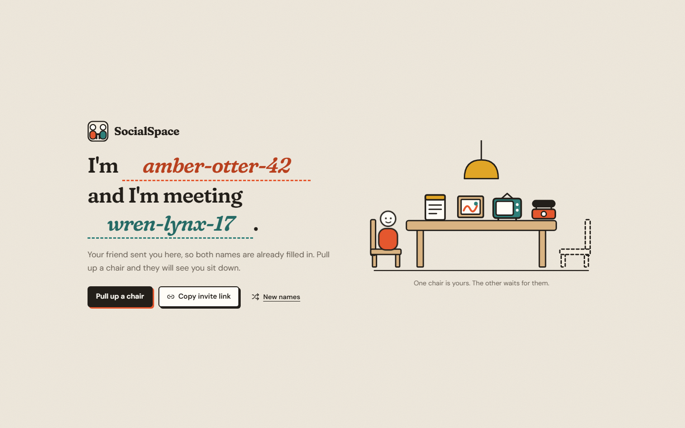
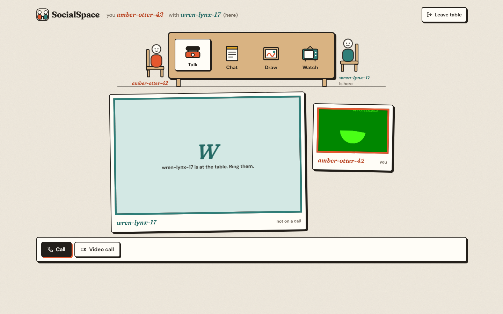
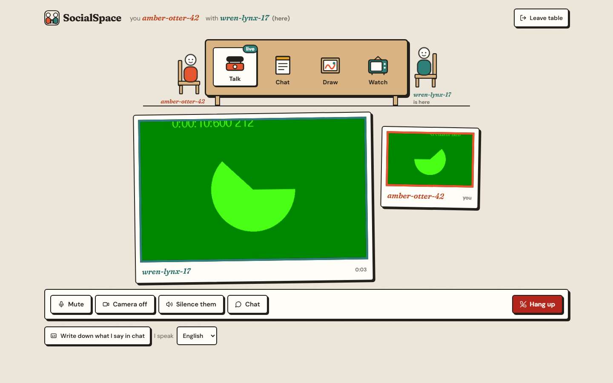
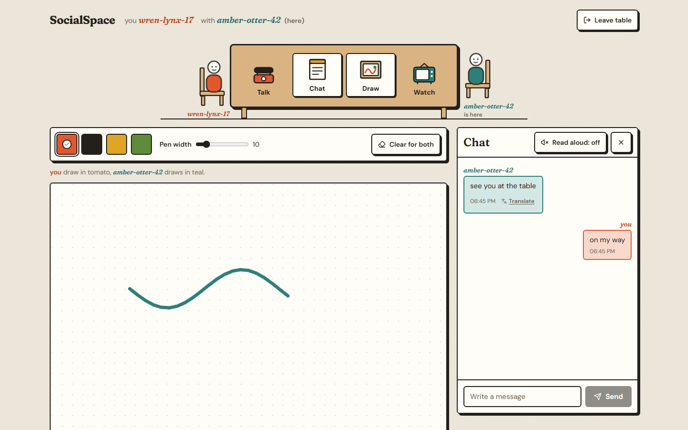
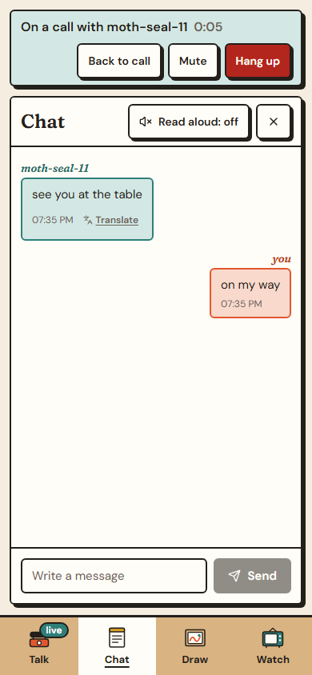

# SocialSpace

A private table for two. Two people each type a name, connect, and can then talk (audio or video), chat, draw on a shared sheet and watch a video together. There are no accounts: you meet under a name you both agree on.



| Room, friend present | In a call |
| --- | --- |
|  |  |

| Drawing together | Chat on a phone |
| --- | --- |
|  |  |

## How the pieces connect

1. The interface is a Next.js app (React 19, Tailwind). It is static pages plus scripts and can be hosted anywhere that serves a Next.js build.
2. When you pull up a chair, the page opens a WebSocket to a small relay (`server.js`, Node and the `ws` package) and registers your name.
3. The relay is a switchboard. It remembers which socket belongs to which name and passes JSON messages (chat, drawing strokes, video-sync, call setup) to the friend's name. It stores nothing.
4. Presence ("is your friend here?") is a small ping/pong message the two browsers send each other through the relay every few seconds.
5. Audio and video do not go through the relay. The browsers swap WebRTC setup messages through it, then connect to each other directly. Only Google's public STUN servers are configured, no TURN server.

## Run it locally

```
npm install
node server.js            # relay on ws://localhost:8080 (set PORT to change)
```

In a second terminal, point the interface at the relay and start it:

```
cp .env.example .env.local        # NEXT_PUBLIC_BACKEND_URL=ws://localhost:8080
npm run dev                       # http://localhost:3000
```

Open the page in two browser windows (or two devices), use the invite link from the first one in the second, and pull up a chair in both. Camera and microphone only work on `localhost` or over HTTPS.

`npm run dev:https` starts the dev server with Next.js's experimental local HTTPS, which you need to try the camera and microphone from a phone on your network. Next.js downloads `mkcert` and creates a local certificate authority, which may ask for your password or an administrator prompt. Then open `https://<your computer's address>:3000` on the phone and accept the certificate. This script has not been tested on this project.

If `NEXT_PUBLIC_BACKEND_URL` is not set, the interface falls back to the relay the author hosts (`wss://socialspace-bakend.onrender.com`). Set your own if you fork this.

## Invite links

The first screen builds a link of the form `/?i=<friend's name>&with=<your name>`. The two values are swapped, so when your friend opens it, their name is already in the first blank and yours in the second. Names are lower-cased, spaces become dashes, only `a-z 0-9 - _` are kept, up to 32 characters.

## Deploy

**The interface.** Build with the relay address in the environment, because `NEXT_PUBLIC_` values are compiled into the page:

```
NEXT_PUBLIC_BACKEND_URL=wss://your-relay.example.com \
NEXT_PUBLIC_SITE_URL=https://your-site.example.com \
npm run build && npm start
```

On a hosting service that builds Next.js for you, set the same two variables in its settings. `NEXT_PUBLIC_SITE_URL` is only used for the link-preview image. A site served over `https` needs a `wss://` relay.

**The relay.** Any host that runs Node and allows WebSockets will do. It needs only the `ws` package: `npm install --omit=dev` and `node server.js`, listening on `PORT` (default 8080). Put it behind TLS so it is reachable as `wss://`.

## Files worth knowing

- `components/room.tsx`, `entry-screen.tsx`, `call-panel.tsx`, `chat-panel.tsx`, `draw-activity.tsx`, `watch-activity.tsx`: the screens.
- `components/websocket-provider.tsx`, `presence-provider.tsx`, `call-provider.tsx`: relay connection, who is here, and WebRTC.
- `server.js`: the relay.
- `public/sw.js`: service worker (pages are network-first, build files are cached).
- `scripts/brand/make_brand.py`: regenerates the icons and share image from one SVG mark (needs Chrome and Pillow).

## Limitations

- No accounts or authentication. Anyone can register any name, including one in use, and the relay will hand it to the newest connection. Treat names as meeting places, not identities.
- The relay tells every connected client when any name disconnects, and forwards anything addressed to a name. Do not rely on it for privacy beyond that.
- No TURN server, so calls can fail between restrictive networks (some corporate or mobile networks).
- Free hosting often puts the relay to sleep, so the first connection can take up to a minute. The page shows "Connecting to the server" while it waits.
- Direct video files (.mp4, .webm, .ogg) stay in sync. YouTube, Twitch, Vimeo and Dailymotion links open for both people, but each controls their own player.
- There is no ringtone, only the on-screen banner.
- Translation uses unofficial Google Translate web endpoints without a key, so chat text you translate is sent to Google, and the service may stop working or be blocked by the browser. A small built-in phrase list is the fallback.
- Drawing strokes and chat are not stored anywhere; they exist only while both people are connected.

## Licence

No licence has been chosen yet, so by default all rights are reserved.
